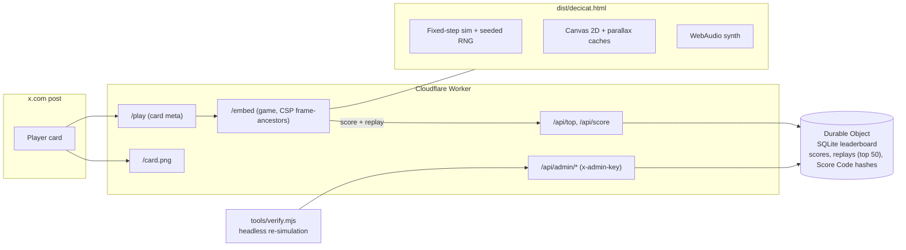

# DECICAT - A Decibel Adventure

**A retro pixel endless platformer you can play right inside an X post.** Hop across candlestick charts, stomp bears, outrun front-running bots, topple the Bear King and ride the rocket to the Decibel moon.

### ▶ [Play it: decicat.bitcade.xyz/play](https://decicat.bitcade.xyz/play)


## Credits

- **Original Decicat concept by [@doncastro](https://x.com/doncastro)** ([the original post](https://x.com/doncastro/status/2104453582913184174))
- **Game by [@angelataptos](https://x.com/angelataptos)**

Decicat is Castro's character, and the Decibel name and logo belong to Decibel. This is a fan / community game, **not an official Decibel product**.

---

## How to play

| Input | Action |
|---|---|
| Tap / click / Space | Jump (hold for a higher jump) |
| Tap again in the air | Double jump |
| Land on a bear | Stomp it |
| M / P | Mute / pause |
| ♪ and speaker icons | Music and sound effects on/off (remembered) |

**Scoring:** distance, plus coins, stomps and bonuses (outrunning bots, the Bear King, the rocket ending). The HUD's BTC number is just for fun; it is not a real price.

**40x:** grab the gold 40x box for a 4-second invincible rocket boost.

**Power-ups** (rare, at most one of each per stage): **Stop-Loss** blocks one hit or fall · **Liquidity Magnet** pulls in coins · **Limit Order** slow-mo · **Diamond Paws** brief invincibility.

### The 10 stages (45 s each)

| # | Stage | What happens |
|---|---|---|
| 1 | Order Book | Warm-up across the candle chart in the neon city |
| 2 | Funding Storm | Wind gusts push you around in the rain |
| 3 | Liquidation Rain | Red candles drop from the sky (watch the warnings) |
| 4 | Bear Market | Bears walk and charge along the candles; stomp them |
| 5 | Whale Waters | A candle sea; ride breaching whales and jump off before they dive |
| 6 | Short Squeeze | Hydraulic bars slam down over pressure tunnels; stay low |
| 7 | Flash Crash | Gravity flips after a glitch warning; run on hanging candles |
| 8 | Front-Runner Alley | Shadow bot Decicats replay your path and cut past on your lane; be airborne when they pass |
| 9 | Bear King | Boss fight: dodge thrown red candles and shockwaves, stomp his head 3 times while he lunges |
| 10 | Launch Pad | Dawn rocket facility with countdown boards; reach the rocket on the pad |


### The rocket ending and Moon Mode

Clear stage 10 and Decicat boards the rocket: countdown, liftoff, a flight to the moon and a landing on the big Decibel moon (**TRADE LOUD.**). You get a +10000 ending bonus, then **Moon Mode**: endless, the hardest mode, with low gravity, meteors, a mix of every hazard and remixed music. Leaderboard entries that reached the moon show a little moon icon.

| Bear King | Liftoff | Landing |
|---|---|---|
|  |  |  |

### Trophies and skins

14 trophies (First Hop, Bear Stomper, Storm Chaser, Whale Rider, Squeeze Play, Upside Down, Outrun The Bots, Kingslayer, To The Moon, Full Send, Clean Stage, Coin Hoarder, Full Kit, Moon Walker), with a toast when you unlock one and a Trophies screen on the title. Some unlock cosmetic skins: **Night, Hoodie, Gold, Laser Eyes, Astronaut**. Pick one with the arrows next to the cat on the title screen.


### Leaderboard and Score Codes

Hosted copies use one global top-20 leaderboard. Every score is stored, so your rank is exact ("You placed #37"). A **top-5** run gets a private **Score Code** (`DCAT-XXXX-XX`), shown once and saved on your device. Keep it: it proves the score is yours. **Share on X** posts your time, stage and rank with a link to the game.


## Features

- One-touch controls that work the same with mouse, keyboard and touch; plays in the X card iframe, on phones and on desktop
- 10 hand-built stages with unique mechanics, a boss, a cutscene ending and an endless Moon Mode
- Original chiptune / synthwave soundtrack and SFX, synthesised live (no audio files)
- Global leaderboard with exact ranks, an offline-safe score queue and Score Codes
- Deterministic replays: every top run can be re-simulated and verified
- Trophies, unlockable skins and a share-to-X button
- One self-contained HTML file (about 290 KB) that also runs offline from disk

Music previews (rendered from the in-game synth): [title theme](docs/music/title_theme.mp3) · [stage 9 Bear King](docs/music/stage9_bear_king.mp3) · [Moon Mode](docs/music/moon_mode.mp3)

---

## Tech

### Rendering
- Vanilla JavaScript and Canvas 2D, no frameworks or dependencies.
- The game renders at a low logical resolution (the short side is 240 px, or 200 px on small phones; the long side follows the aspect ratio) and is scaled up in device pixels by an **integer factor** (whenever it's 2x or more) with `image-rendering: pixelated`, so pixels stay crisp at any size and DPR.
- Parallax backgrounds are **pre-rendered into offscreen canvases** per stage and layer, then scrolled. The caches are bounded (LRU with fixed caps), so memory stays flat over long runs and window resizes.

### Art
- The Decicat sprites are hand-cleaned pixel art traced from the original concept art (run cycle, jump, idle), stored as compact pixel data in `sprites.js` (along with a 5x7 bitmap font).
- Skins are minimal palette / pixel edits of the same traced sprite.
- All backgrounds (city, storm, castle, launch facility, moon) are drawn in code: buildings, racks, gantries, banners, stars, weather.
- The Decibel mark is traced into a 48 px mask and tinted per stage as the "moon".

### Music and SFX
- An original **WebAudio synthesiser and sequencer**, generated at runtime: no audio files ship with the game.
- **Fixed voice pools**: pulse, saw, triangle and noise voices, a kick made from a pitch-swept sine with a noise click, built once per song and played by AudioParam automation, so no audio nodes are created per note.
- Mix bus with **delay + convolution reverb**, a **compressor and a limiter**, and a **sidechain duck** on the kick.
- Each stage has its own track with its own key and tempo; transitions are **quantised to the bar**.

### Determinism and replays
- **Fixed 60 Hz timestep**, a single **seeded RNG** for all gameplay, inputs applied only on step boundaries.
- Every run records `{seed, viewport size, delta-encoded press/release frames, resizes}`, usually a few hundred bytes. Re-simulating that log headlessly gives the identical score, stage and outcome, including the rocket cutscene (its time is frozen, so watching or skipping it doesn't change anything).

### Backend
- **Cloudflare Worker** plus one **SQLite-backed Durable Object**: writes are serialised and reads are consistent, ranks are exact.
- Rate limiting per IP, plausibility checks (points per second, bonus caps, run length), a name filter.
- Replays are stored only while a run is in the **top 50**.
- **Score Codes** for the top 5: an HMAC of the entry id; only its SHA-256 is stored.
- Admin API plus `tools/verify.mjs` to fetch a stored replay, re-simulate it and save the verified result (including whether it reached the moon).
- **X player card** meta on `/play`, a frameable `/embed` with a `frame-ancestors` CSP that allows x.com and twitter.com, and a `card.png` poster.

### Build, test, deploy
- `build.mjs` inlines `config.js`, `sprites.js`, `audio.js`, `bg.js` and `game.js` into `dist/decicat.html`.
- Tests drive headless Chrome with `playwright-core`: UI flows, the v5 features, **replay determinism** (live runs vs. headless re-simulation, with resizes and the ending), leaderboard concurrency and offline/online E2E against `wrangler dev`, and a **memory soak** at 4K.
- Deploy with `wrangler`.



## Local development

```bash
# play from disk (scores stay on the device)
open index.html            # or dist/decicat.html

# build the single file
node build.mjs             # -> dist/decicat.html

# tests (needs Chrome; set CHROME=/path/to/chrome if it isn't /usr/bin/google-chrome)
cd tools && npm install
node test3.mjs && node test5.mjs
ZT=8 node replaytest.mjs   # determinism (Z0=8 to start at stage 8)
```

Debug URL params: `?zone=3` start in a stage (11+ = Moon Mode) · `?bot` autoplay · `?god` no deaths · `?seed=7` repeatable level · `?zt=6` seconds per stage · `?autostart` · `?nogate` · `?poster` · `?record` · `?mem`. Runs with debug params are stored but never ranked.

### Local worker

```bash
cd server
printf 'ADMIN_KEY=%s\n' "$(openssl rand -hex 16)" > .dev.vars     # git-ignored
npx wrangler dev --local --port 8787 --var DEV:1
node ../tools/lbtest.mjs && node ../tools/e2e_online.mjs && node ../tools/contest_e2e.mjs
```

## Deploy (your own copy)

1. In `server/wrangler.toml`, set your values:
   - `account_id = "<YOUR_CLOUDFLARE_ACCOUNT_ID>"` (or export `CLOUDFLARE_ACCOUNT_ID`)
   - the legacy KV binding: `npx wrangler kv namespace create SCORES` and paste the id over `<YOUR_KV_NAMESPACE_ID>` (only read once, to import v1/v2 scores; any empty namespace works)
   - `routes`: replace `decicat.bitcade.xyz` with your own custom domain, or remove the line and use workers.dev
2. Set the admin secret: `npx wrangler secret put ADMIN_KEY`
3. `node build.mjs && cd server && npx wrangler deploy`
4. Check `curl https://<your-host>/api/top`. To verify the top runs: `node tools/verify.mjs all --base https://<your-host> --save 1` (reads the key from `.admin_key` in the repo root or `ADMIN_KEY`).

## Project structure

```
.
├── index.html          page shell, name editor
├── config.js           runtime config (local or remote scores, API base)
├── sprites.js          traced Decicat / bear sprites, bitmap font
├── audio.js            WebAudio synth, sequencer, songs and SFX
├── bg.js               parallax stage backgrounds, Decibel mark
├── game.js             game loop, stages, physics, UI, replays, scores
├── build.mjs           inlines everything into dist/decicat.html
├── dist/decicat.html   the playable single file
├── server/
│   ├── worker.js       Worker + Durable Object leaderboard, card pages, admin API
│   ├── play.html       X player-card page
│   ├── card.png        card poster
│   └── wrangler.toml   deploy config (placeholders)
├── tools/              headless-Chrome tests, replay verifier, capture scripts
├── docs/               screenshots and music previews
└── CHANGELOG.md
```

## License

**All rights reserved.** Contact [@angelataptos](https://x.com/angelataptos) for permission to reuse the code. The Decicat character belongs to [@doncastro](https://x.com/doncastro), and the Decibel name and marks belong to Decibel.
