# DECICAT

A one-touch pixel-art runner. Hop across candlestick charts, stomp bears, outsmart a boss, and ride a rocket to the moon.

**[Play it in your browser](https://decicat.bitcade.xyz/play)** · free, no sign-up, works on phones and right inside X

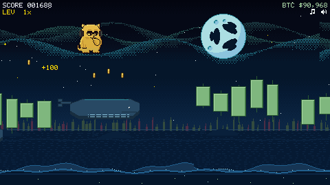

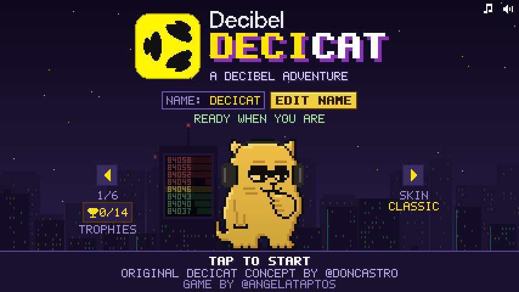

## Highlights

- **10 hand-made stages**, each with its own scenery, hazards and original music
- **A boss fight** against the Bear King, then a **rocket ride to the Decibel moon**
- **Endless Moon Mode** after the ending: low gravity, meteors and solar wind storms
- **Power-ups**, a 40x rocket boost, **14 trophies** and **6 skins**
- **Global leaderboard** with exact ranks, verifiable replays and **Score Codes** for the top 5
- **Privacy-first**: no accounts, no cookies, only an anonymous daily player count
- Plain JavaScript in one self-contained HTML file: no frameworks, no image or audio files

## Credits

Original Decicat concept by [@doncastro](https://x.com/doncastro)  
Game by [@angelataptos](https://x.com/angelataptos)

## How to play

Decicat runs on its own. Your only job is to jump.

| Input | Action |
| --- | --- |
| Tap, click, Space, Up arrow, W or Enter | Jump |
| Hold the jump | Jump higher |
| Tap again in mid-air | Double jump |
| M | Mute or unmute everything |
| P or Esc | Pause |

The two icons in the top-right corner switch music and sound effects on and off separately, and the game remembers your choice. It also pauses itself when you switch tabs.

Green candles are safe to stand on. Red candles hurt, but brushing past one earns a close-call bonus. Land on a bear from above to stomp it and bounce off its head. Fall into a gap and the run is over.

Your score is the distance you cover plus everything you pick up along the way: coins, power-ups, stomps, whale rides and boss bonuses. The BTC number in the corner of the screen is just for fun. It isn't a real price.

## The 10 stages

Each stage lasts 45 seconds and gets a little harder from start to finish. Every stage has its own scenery and its own music.

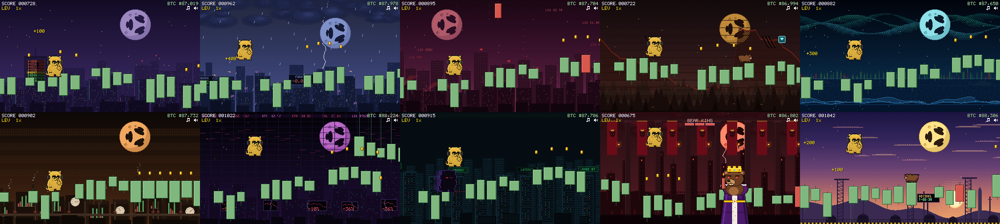

| # | Stage | What to expect |
| --- | --- | --- |
| 1 | Order Book | A calm night skyline to learn the jump. |
| 2 | Funding Storm | Rain and wind gusts that push you around mid-jump. |
| 3 | Liquidation Rain | Red candles drop out of the sky. |
| 4 | Bear Market | Bears patrol the candles. Stomp them or jump over them. |
| 5 | Whale Waters | A candle sea. Land on a breaching whale and ride it, then jump off when it spouts and dives. |
| 6 | Short Squeeze | Pressure tunnels where a hydraulic bar slams down. Stay low to thread the gap. |
| 7 | Flash Crash | After a glitch and an arrow warning, gravity flips for a few seconds and you run on the hanging candles. |
| 8 | Front-Runner Alley | Dark bot Decicats copy your path a moment late, then lock onto your lane and cut past you. |
| 9 | Bear King | A storm castle of red charts and a boss fight. |
| 10 | Launch Pad | A dawn rocket facility with gantries, countdown boards and bears, ending on the steel pad where the rocket waits. |

| Whale Waters | Flash Crash |
| --- | --- |
| 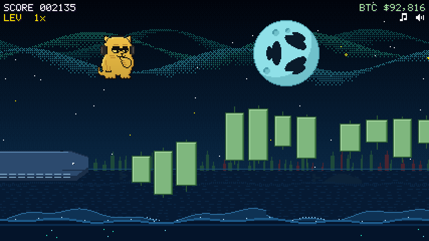 | 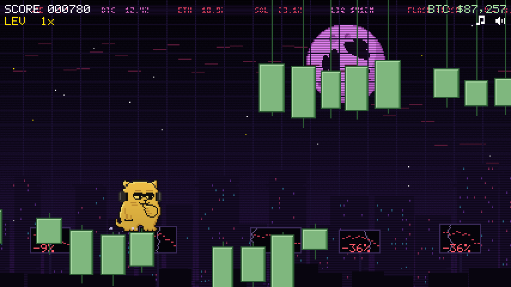 |

### Front-Runner Alley

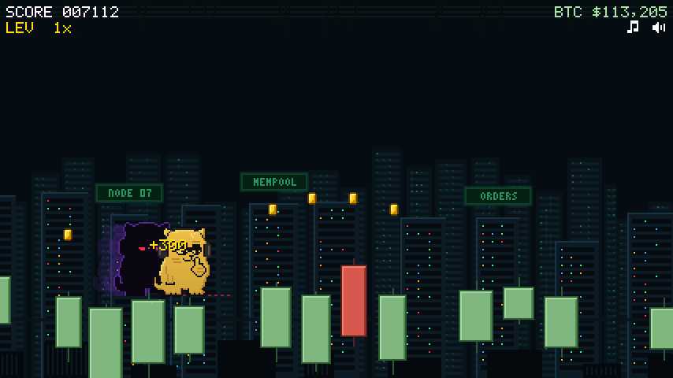

A red dotted line shows which lane a bot has locked onto. Bots can only trip you while you're on the ground in their lane, so be in the air as one passes (+50) or land on it to stomp it (+100).

### The Bear King

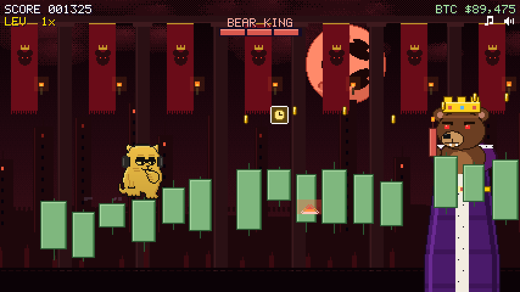

Stage 9 belongs to the Bear King, a crowned bear with a red-candle sceptre. Every attack is telegraphed:

- He raises his sceptre and hurls red candles that land ahead of you.
- He hops and slams the floor, sending a shockwave along the ground that you need to jump.
- His lane flashes red and he lunges with his head low.

The lunge is your opening. Land on his head three times to beat him. His health bar sits in the HUD. Beat him and he flees for +5000. If you simply survive the stage, he retreats and you get +1000.

### The rocket ending

Make it through stage 10 and Decicat boards the rocket. A short cutscene plays the countdown, the liftoff and the flight, and lands on the big Decibel moon with fireworks. You can tap to skip it. Then comes the "You made it to the Moon!" screen with your run time, your score and a +10000 bonus.

| Liftoff | To the moon | Landing |
| --- | --- | --- |
| 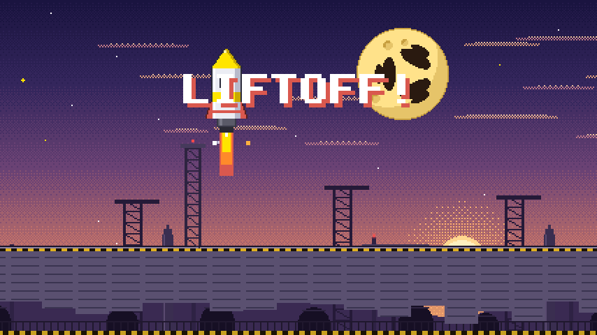 | 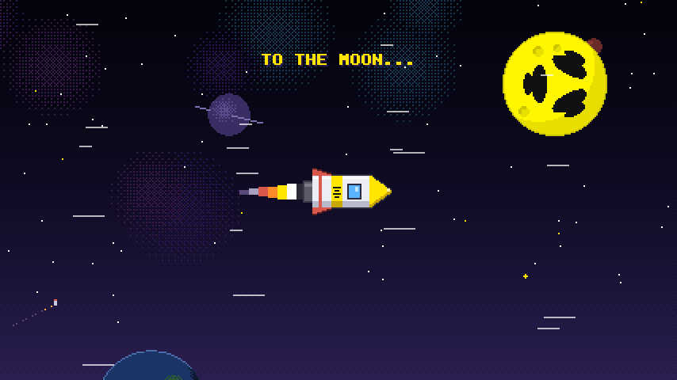 | 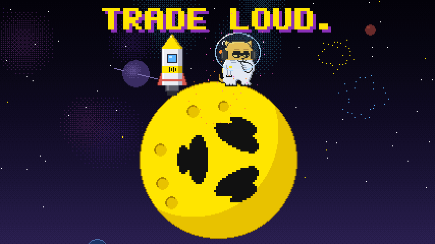 |

### Moon Mode

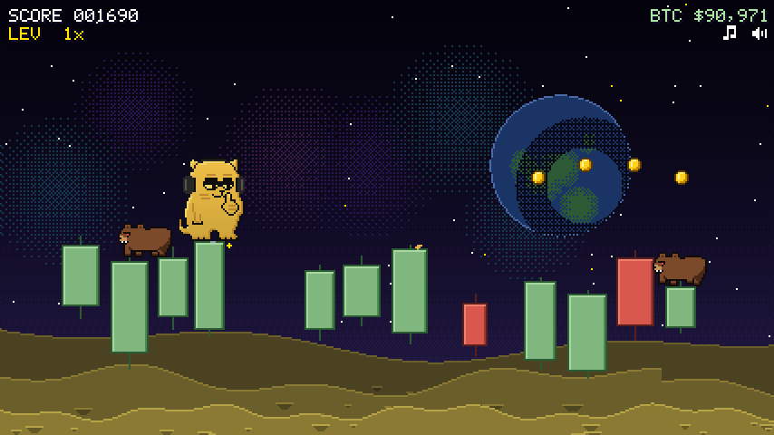

After the ending the run keeps going in Moon Mode. It is endless and the hardest part of the game: low gravity, falling meteors, and a rotating mix of hazards from the earlier stages that changes every lap while the speed creeps up. The music cycles through faster remixes of the stage tracks.

The moon has no air, so there's no wind up there. Instead, **solar wind** storms roll in: streams of charged particles from the Sun sweep across the sky with a faint aurora, static crackles over the ground and around Decicat, and the push nudges you sideways mid-jump. Earth hangs in the sky above you.

## Power-ups

Power-ups are rare. Each one appears at most once per stage, and active ones show under the score with a timer bar.

| Power-up | Effect |
| --- | --- |
| Stop-Loss | Absorbs one hit, or bounces you back up from one fall. |
| Liquidity Magnet | Pulls nearby coins to you for 6 seconds. |
| Limit Order | Slows the whole game to 0.6x speed for 4 seconds. |
| Diamond Paws | Makes you invincible for 3 seconds, falls included. |

| Diamond Paws in Short Squeeze | The 40x boost |
| --- | --- |
| 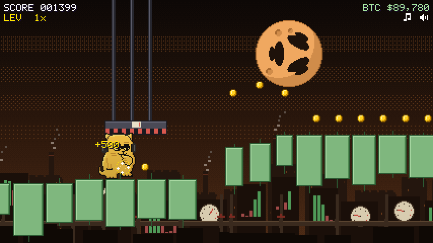 | 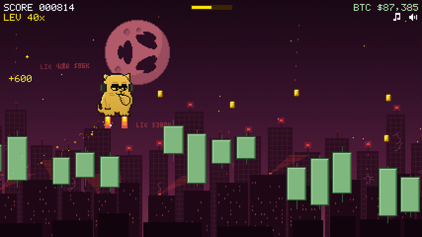 |

Each stage also hides one gold **40x** box. Grab it for a 4-second rocket boost that carries you over everything and smashes through red candles, bears and bots in your path.

Coins are worth 100 points each and are scattered all over the stages.

## Skins and trophies

There are 14 trophies to earn, from your first jump to surviving a minute of Moon Mode. A toast pops up when you unlock one, and the Trophies button on the title screen lists them all.

Five of them also unlock a skin for Decicat. Pick a skin with the arrows next to the cat on the title screen.

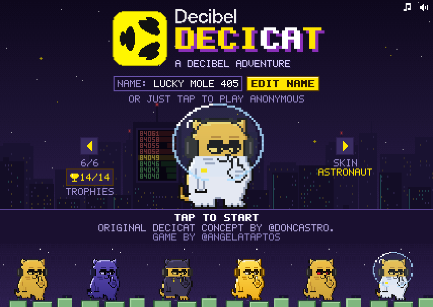

| Skin | Unlocked by |
| --- | --- |
| Classic | Available from the start |
| Night | Storm Chaser: survive the Funding Storm |
| Hoodie | Whale Rider: ride a whale |
| Gold | Full Send: grab the 40x box five times in one run |
| Laser Eyes | Kingslayer: beat the Bear King |
| Astronaut | To The Moon: reach the moon |

Trophies, skins, your best score and your display name are saved in your browser. There is no account.

## Leaderboard and Score Codes

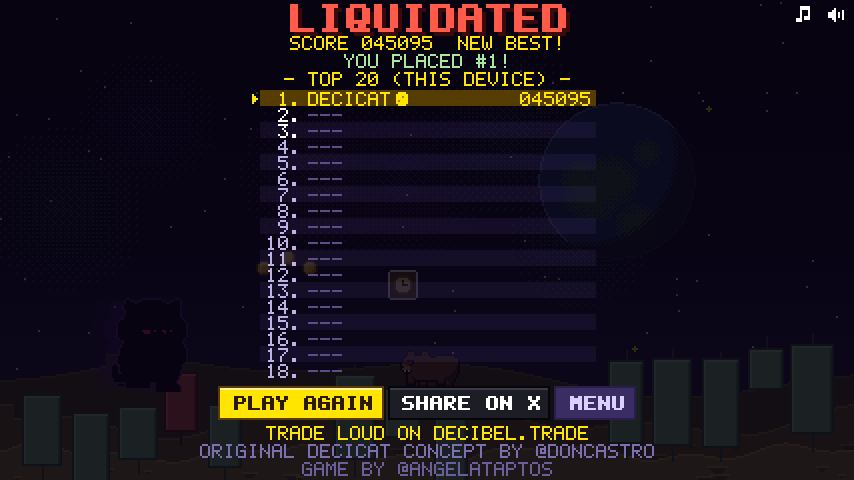

The online leaderboard shows the global top 20. Every score is kept, so after each run you see your exact place, even if it's #37.

There's no sign-in. You start with a random anonymous name like "Fuzzy Otter 493", or you can pick your own name of up to 16 letters and numbers with the Edit Name button. Offensive names are filtered out.

If you finish in the top 5, you get a Score Code such as `DCAT-7K3Q-X9`. It is shown once, so take a screenshot. The code proves that the score is yours. Your browser also keeps a copy.

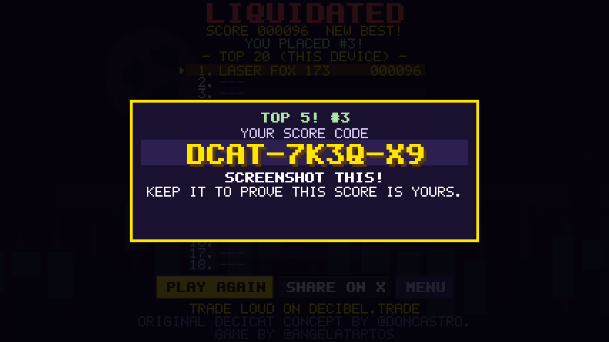

To keep the board honest, each run is recorded as a tiny log of when you pressed and released jump, together with the random seed that built the level. The game is fully deterministic, so playing that log back through the same code produces the exact same run and the exact same score. The server keeps these recordings for the top 50 runs, which lets any high score be checked by replaying it. Runs that reached the moon get a small moon icon on the board.

If you're offline, your score waits in the browser and is sent automatically later, without ever being counted twice.

## Playing on X

Share the link https://decicat.bitcade.xyz/play on X and it unfolds into a player card, so people can play right inside their timeline. The Share on X button on the game-over screen writes a post with your time, how far you got and your rank.

## Privacy

We'd like to know how many people enjoy the game, so it keeps a simple, anonymous count of players per day.

Your browser gets a random ID that has nothing to do with you, your name or your device. Once per visit the game sends that ID and whether you started a run. The server never stores the ID itself, only a salted one-way hash of it.

No IP addresses, names, cookies or device details are saved. The count is completely separate from the leaderboard and never affects gameplay. Local copies of the game don't send anything, and adding `?noping` to the URL turns it off.

## Under the hood

DECICAT is plain JavaScript with no frameworks and no runtime dependencies.

**Rendering.** Everything is drawn on an HTML5 canvas at a low native resolution, roughly 240 pixels on the short side. The browser scales it up with smoothing turned off, in whole-number steps wherever the screen allows, so the pixels stay crisp. The sprites, the bitmap font, the parallax skies and the Decibel moons are hand-made pixel art stored as data in the code. There are no image files in the game itself.

**Audio.** There are no audio files either. All music and sound effects are synthesized live with the Web Audio API from note data in `audio.js`. Every stage has its own original track, plus themes for the title, the 40x boost, Moon Mode and the results screen. You can hear a few of them in [docs/music](docs/music): the [title theme](docs/music/title_theme.mp3), the [Bear King stage](docs/music/stage9_bear_king.mp3) and [Moon Mode](docs/music/moon_mode.mp3).

**Determinism.** The game logic runs on a fixed 60 Hz timestep, all randomness comes from one seeded generator, and input is applied only at step boundaries. That is what makes the replay checks possible. Visual effects like dust and screen shake use their own randomness and never touch the game state.

**Backend.** A single Cloudflare Worker serves the game, the X player card and the API. All scores live in one SQLite-backed Durable Object, which gives exact ranks without race conditions. It also handles rate limiting and duplicate-free resubmits. Reads are cheap: the sorted board is kept in memory and saved as a single row, so loading the top 20 or working out your rank doesn't rescan the scores table, and the cleanup queries are indexed.

**Single-file build.** `build.mjs` inlines every script into `dist/decicat.html`, one self-contained file that the Worker serves and that also works offline straight from disk.

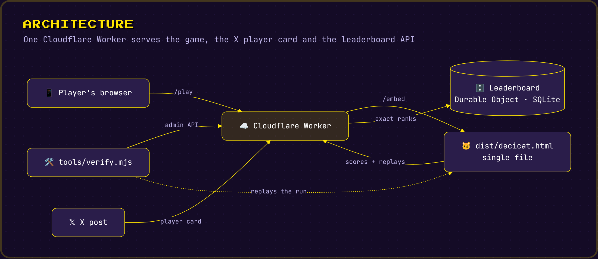

<details>
<summary>Diagram source (Mermaid)</summary>

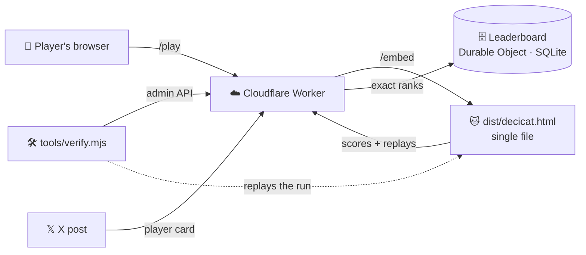

</details>

## Project layout

```
index.html       Page shell, canvas and the name editor
config.js        Chooses the online or on-device leaderboard
sprites.js       Pixel sprites and the bitmap font
audio.js         Web Audio synth, soundtrack and sound effects
bg.js            Parallax backgrounds and the pixel Decibel moons
game.js          Game logic, stages, boss, ending, UI and leaderboard client
build.mjs        Builds dist/decicat.html
dist/            The built single-file game
server/
  worker.js      Cloudflare Worker and the Leaderboard Durable Object
  wrangler.toml  Worker configuration
  play.html      Share page with the X player-card tags
  card.png       Card image
tools/           Headless Chrome tests, replay verifier, stats and capture scripts
docs/            Screenshots and music previews
CHANGELOG.md     Release history
```

## Running locally

No build step is needed to play. Open `index.html` or `dist/decicat.html` in a browser. A copy opened from disk or from localhost keeps its leaderboard on your device. Hosted copies use the online board.

A few URL parameters help during development. Runs played with any of them are never ranked.

| Parameter | Effect |
| --- | --- |
| `?zone=3` | Start at a given stage (11 or higher is Moon Mode) |
| `?seed=7` | Use a fixed level seed |
| `?zt=6` | Seconds per stage |
| `?bot` | Let the game play itself |
| `?god` | No deaths |
| `?boost` | Start with the 40x boost |
| `?nogate` | Skip the Tap to Start screen |

### Building

```sh
node build.mjs
```

This writes `dist/decicat.html`. Rebuild after changing any source file, since the Worker and the tests use the built file.

### Testing

The tests drive headless Chrome through `playwright-core`. Install it once, then run the scripts from `tools/`. They look for Chrome at `/usr/bin/google-chrome` unless you set `CHROME`.

```sh
cd tools && npm install
node test3.mjs                                   # UI and regression checks
URL0="file://$PWD/../dist/decicat.html" node test5.mjs   # stages 8-10, ending, trophies, skins, sharing
ZT=8 node replaytest.mjs                         # determinism: replays must reproduce the score
ZT=8 Z0=8 node replaytest.mjs                    # the same, starting at stage 8 and running through the ending
```

The server tests need a local Worker. Create `server/.dev.vars` with a placeholder admin key (this file is git-ignored):

```sh
echo 'ADMIN_KEY=change-me-local-only' > server/.dev.vars
cd server && npx wrangler dev --local --port 8787 --var DEV:1
```

Then, from `tools/`:

```sh
node lbtest.mjs        # leaderboard API
node e2e_online.mjs    # offline queue and resubmit
node contest_e2e.mjs   # replay storage, Score Codes and verification
node ping_e2e.mjs      # anonymous player count
```

`mem2.mjs` runs a long memory soak if you want to check for leaks.

### Deploying

```sh
node build.mjs
cd server
npx wrangler secret put ADMIN_KEY
npx wrangler deploy
```

The secret only needs to be set once. Without it, Score Codes and the admin API are switched off. If you deploy your own copy, replace the custom domain route and the KV namespace id in `wrangler.toml` with your own. The KV binding is only read once, to import scores from an early version of the leaderboard.

### Checking scores

`tools/verify.mjs` fetches a stored run from the server, replays it in headless Chrome with the built game and compares the result with the claimed score. It can also check a Score Code. `tools/stats.mjs` prints the daily player counts. Both need the admin key, from the `ADMIN_KEY` environment variable or a key file.

```sh
cd tools
ADMIN_KEY=your-admin-key node verify.mjs list --game "$PWD/../dist/decicat.html"
ADMIN_KEY=your-admin-key node verify.mjs entry 1 --game "$PWD/../dist/decicat.html"
ADMIN_KEY=your-admin-key node verify.mjs claim DCAT-XXXX-XX
ADMIN_KEY=your-admin-key node stats.mjs --days 30
```

Add `--base http://127.0.0.1:8787` to point either tool at a local Worker.

## Changelog

See [CHANGELOG.md](CHANGELOG.md) for the full release history.
